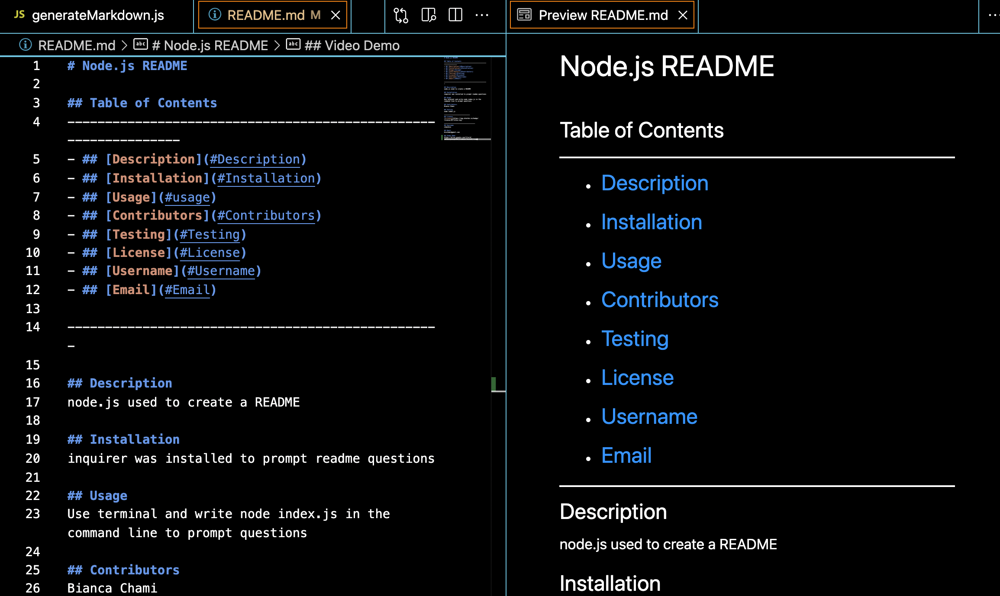
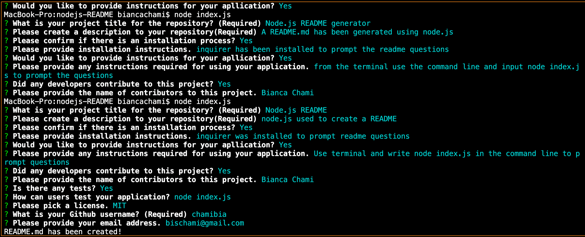

# Node.js README

## Table of Contents
----------------------------------------------------------------
- ## [Description](#Description)
- ## [Installation](#Installation)
- ## [Usage](#usage)
- ## [Contributors](#Contributors)
- ## [Testing](#Testing)
- ## [License](#License)
- ## [Username](#Username)
- ## [Email](#Email)

--------------------------------------------------

## Description
node.js used to create a README 

## Installation
inquirer was installed to prompt readme questions

## Usage 
Use terminal and write node index.js in the command line to prompt questions

## Contributors
Bianca Chami

## Testing 
node index.js

------------------------------
## License 

    
------------------------------------
## Username
chamibia

## Email
bischami@gmail.com

## Video Demo
https://drive.google.com/file/d/1AFA1L3y5AIqS99NTy7Lh0SSxYYAc3sKV/view
